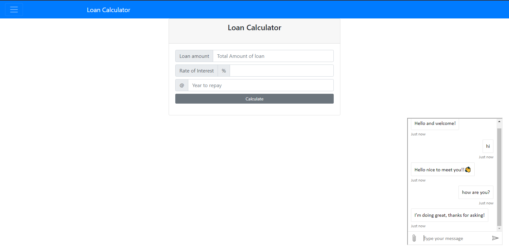
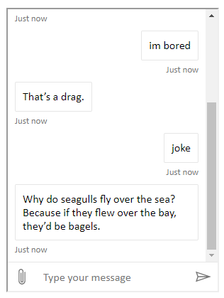

# Loan EMI Calculator With Chatbot

A Web Application consist of Loan Emi Calculator and A ChatBot.

In this project we have Three input fields

### Loan amount -> Where we enter loan amount.

### Rate of Interest  -->  Here we enter rate of intrest in percentage (without '%' sign).

### @  --> Here we enter time period in years.

[Try it now](https://myloanbuddy.azurewebsites.net/)

## Most intresting part of this page is The My Loan Buddy(CHATBOT) 

[At bottom right corner](https://myloanbuddy.azurewebsites.net/)

This chatbot is devloped and deployed on Azure 

## License

MIT
 
See [License](LICENSE.md) for full license text.
